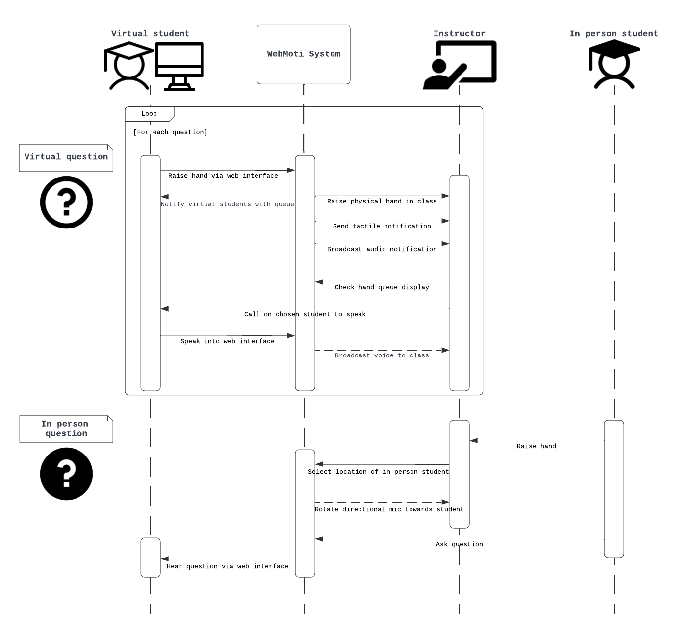

  

<h1 align="center">WebMoti</h1>

 Hybrid learning platform for neurodivergent students 

Check the [setup guide](setup.md) for setup information.

See the [project board](https://github.com/orgs/IMDC/projects/2) for issue priorities.

---

## Features

- [Hold to raise hand](webmoti-react/docs/docs.md#raise-hand)
  - [Hand queue](setup.md#queue)
  - Fireworks
- [Classroom controls](webmoti-react/docs/docs.md#controls-menu)
  - Audio/video
  - Board view zoom and pan
  - 1080p board view
  - Wave hand mode
- [Sounds menu](webmoti-react/docs/docs.md#controls-menu#audio-notification)
  - Nudge professor
  - Select sound
  - Volume control
- Shortcuts
- Admin/prof mixer controls
- Muting system for feedback
- Text to speech
  - TTS chat previews
  - Send TTS message to class
- Live captions
- [AI Schedule](webmoti-react/docs/docs.md#controls-menu#set-class-schedule)
- [Tactile mobile notifications](setup.md#tactile-notifications)
- Chat
- Noise cancellation
- Speaker view
- Share screen
- Backgrounds
