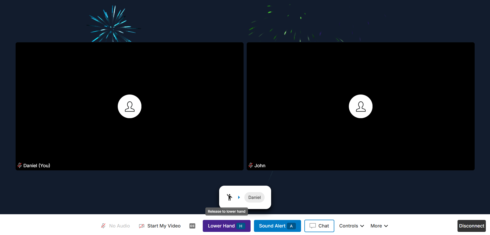
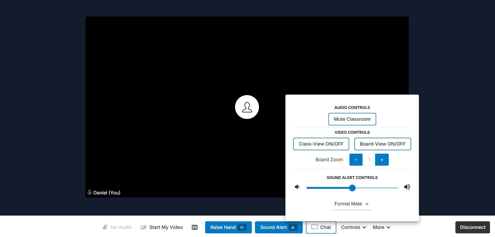
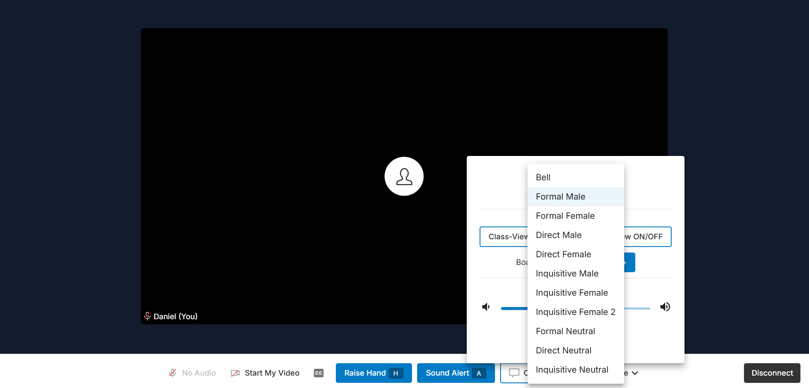

<figure>
  
  <figcaption>Join screen</figcaption>
</figure>

<figure>
  
  <figcaption>Classroom with one participant</figcaption>
</figure>

<figure>
  
  <figcaption>Classroom with two participants</figcaption>
</figure>

<figure>
  
  <figcaption>Raise hand</figcaption>
</figure>

<figure>
  
  <figcaption>Controls menu</figcaption>
</figure>

<figure>
  
  <figcaption>Audio notification</figcaption>
</figure>

<figure>
  
  <figcaption>Set class schedule</figcaption>
</figure>
