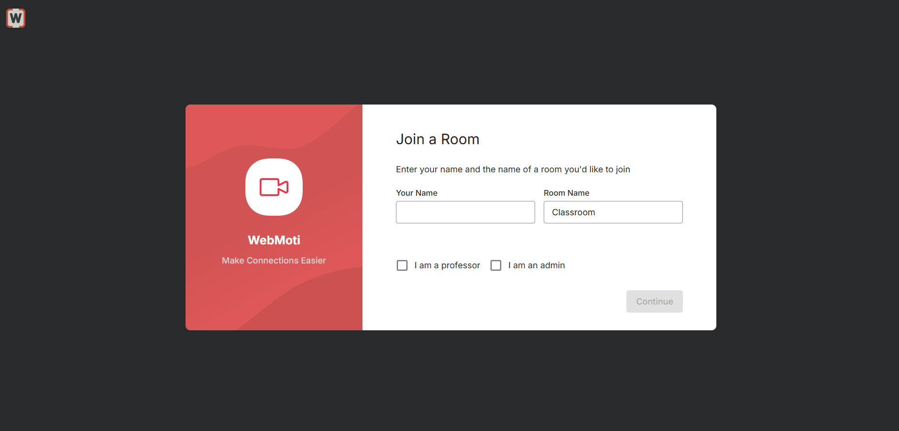

# App screenshots

## Join screen

 

## Classroom with one participant

 

## Classroom with two participants

 

## Raise hand

 

## Controls menu

 

## Audio notification

 

## Set class schedule

