# App screenshots

## Login screen

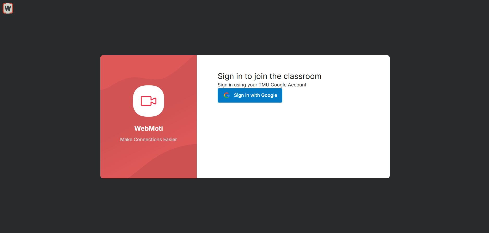

 

## Classroom with one participant

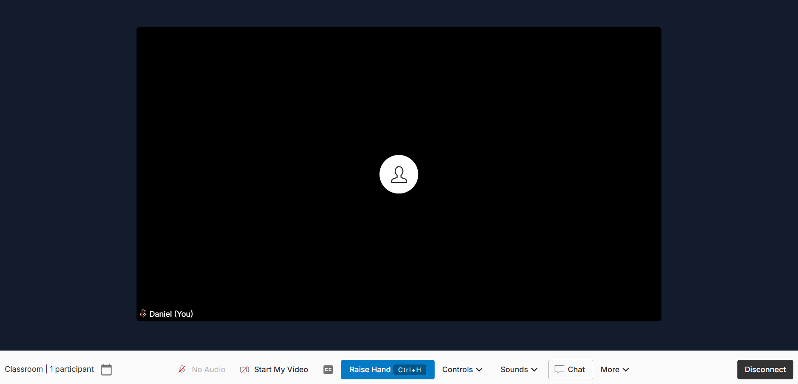

 

## Classroom with two participants

 

## Raise hand

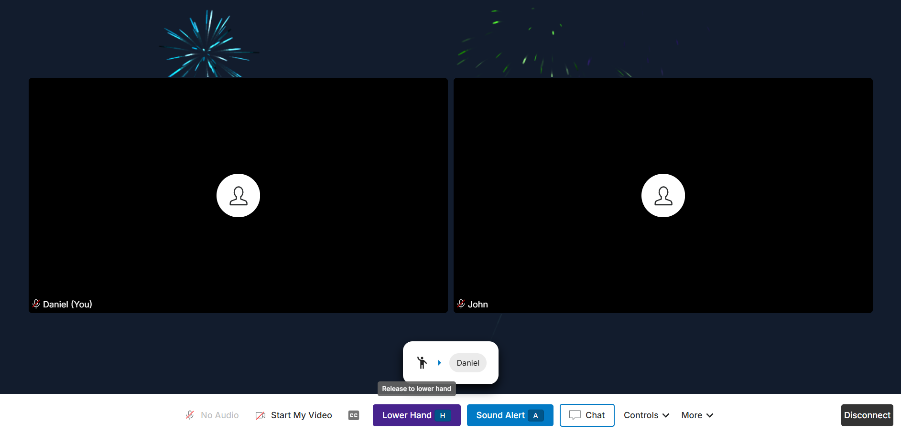

 

## Speaker view

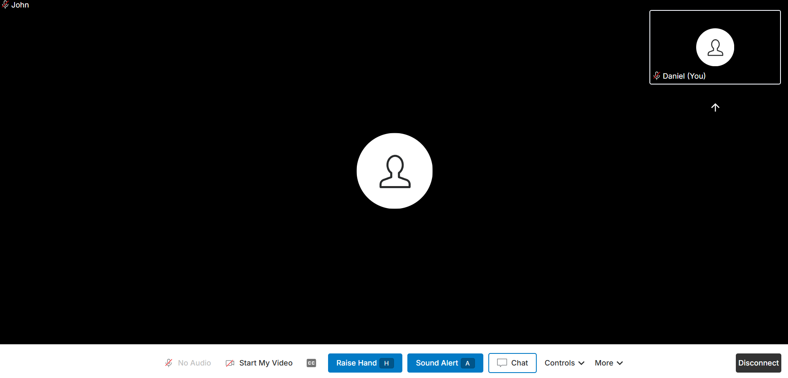

 

## Text to speech

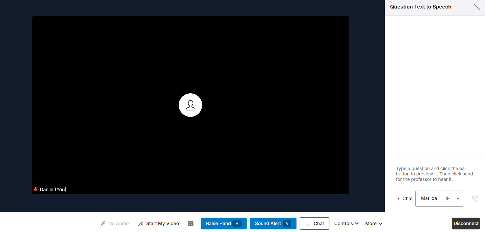

 

## Controls menu

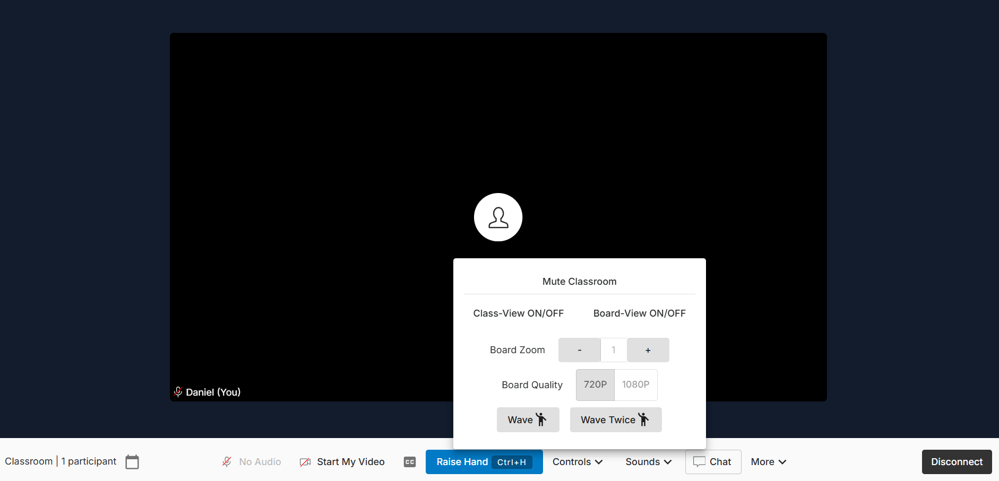

 

## Audio notification

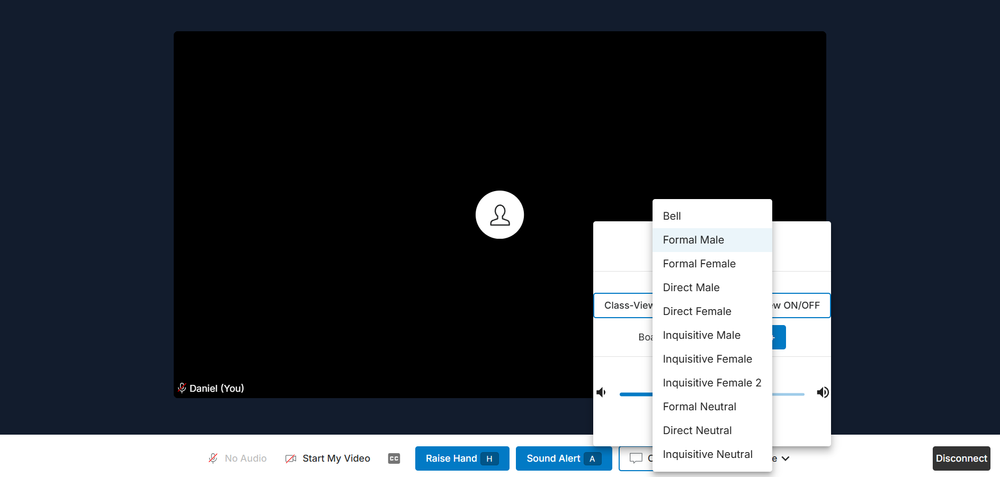

 

## Set class schedule

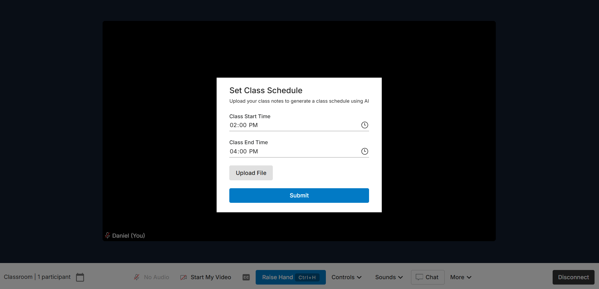

 

## Medium size screen

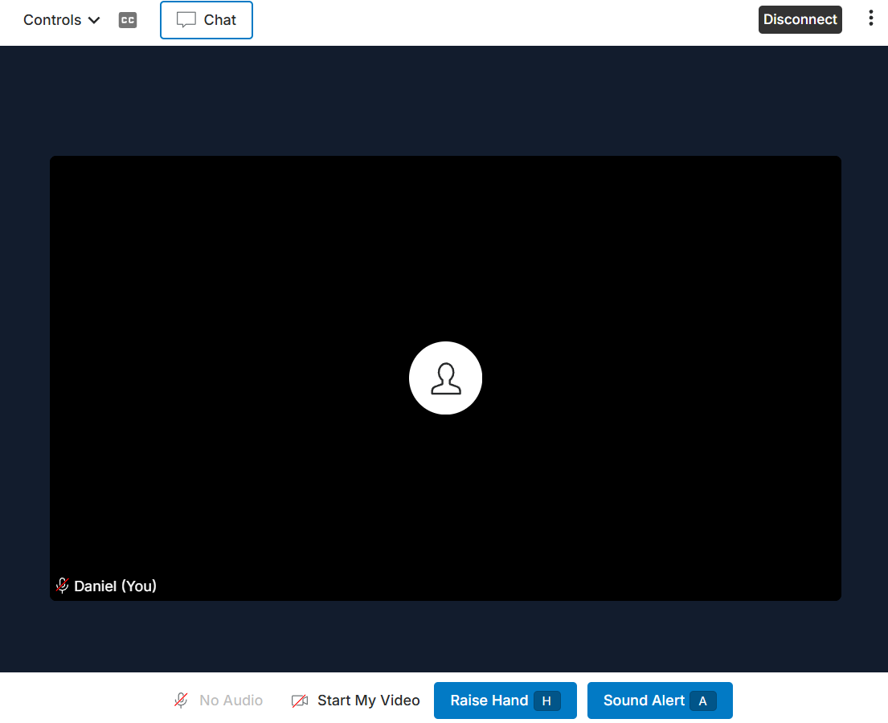

 

## Mobile

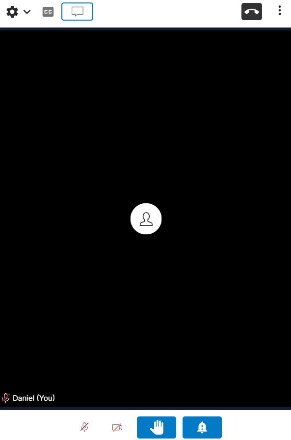

 

## Hand queue with two raised hands

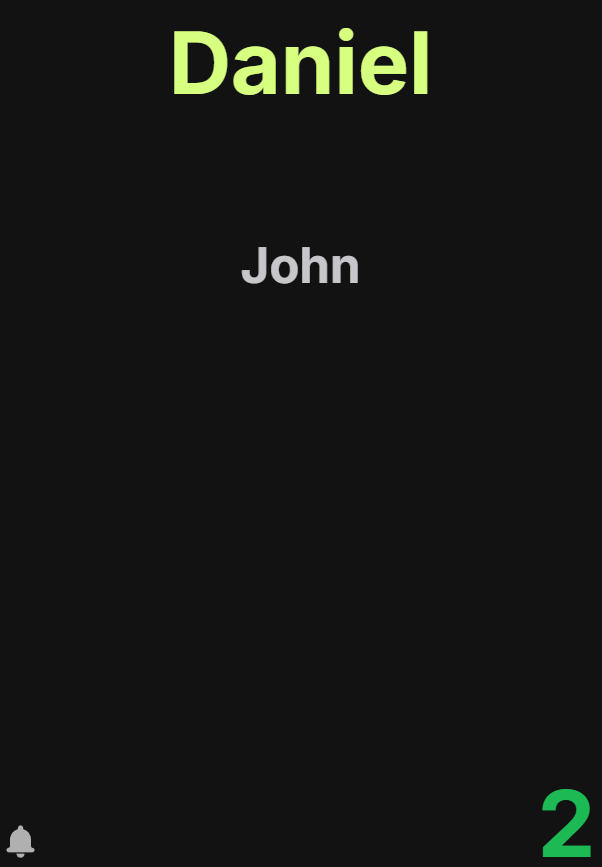

 

## Push to talk (off)

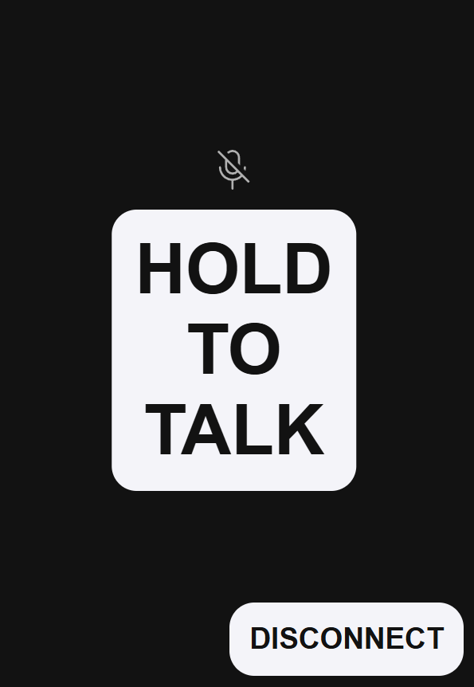

 

## Push to talk (on)

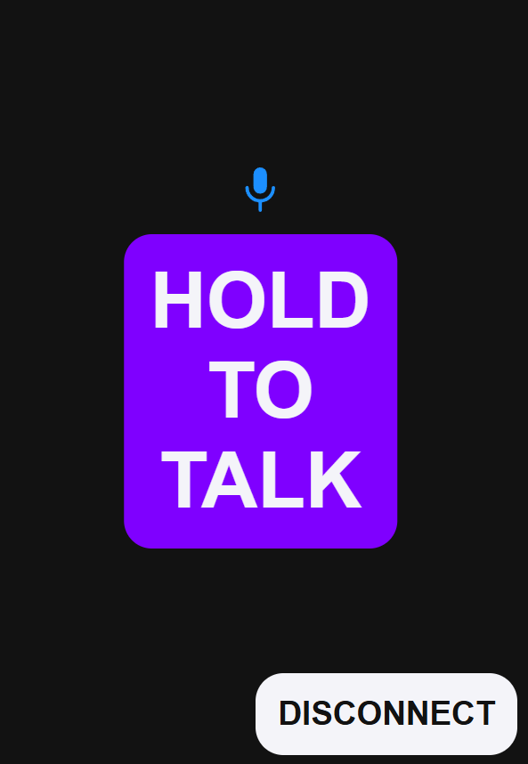

 

## Homepage for in person students

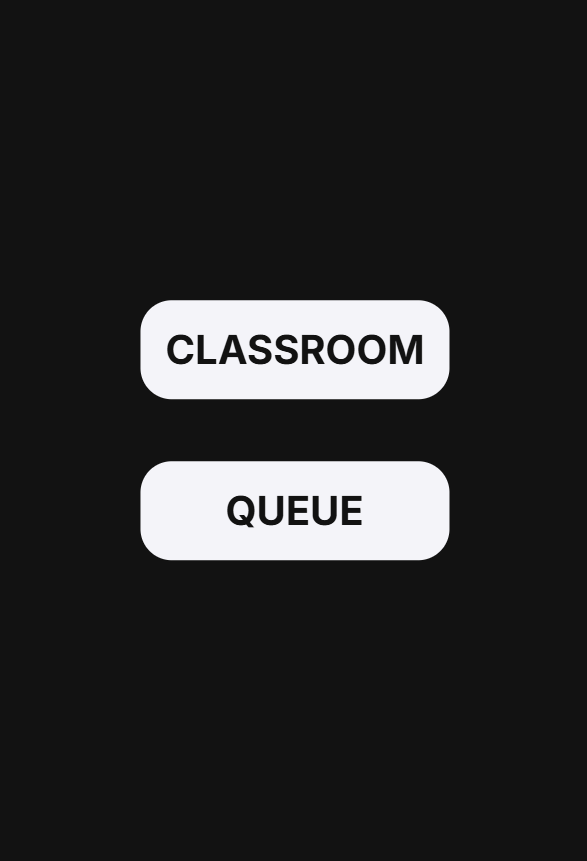

 
