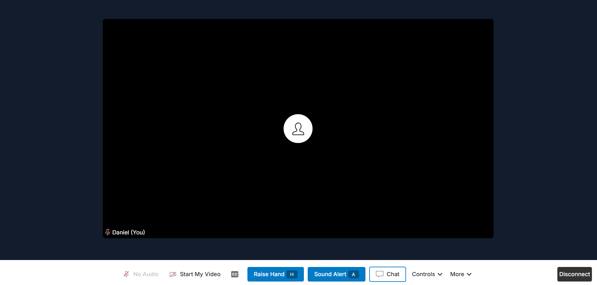
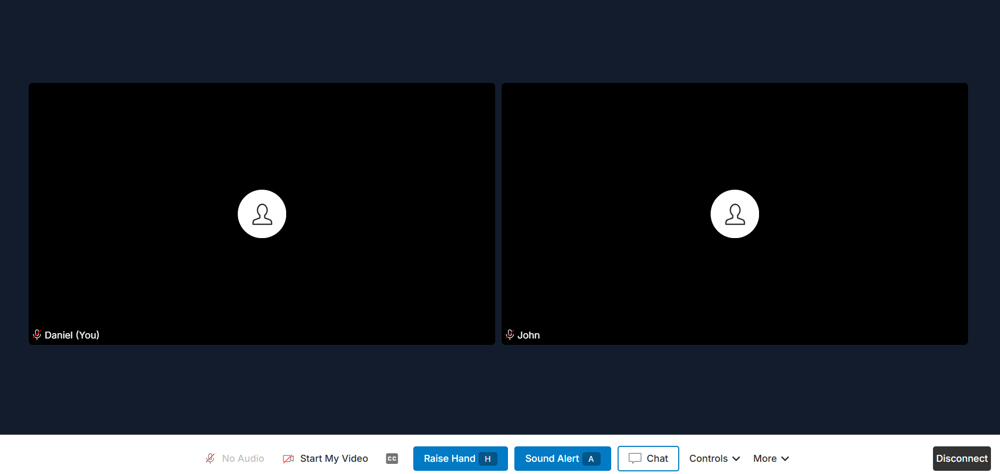
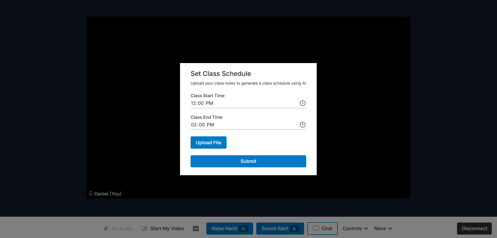

# App screenshots

## Login screen

 

## Classroom with one participant

 

## Classroom with two participants

 

## Raise hand

 

## Speaker view

 

## Text to speech

 

## Controls menu

 

## Audio notification

 

## Set class schedule

 

## Medium size screen

 

## Mobile

 

## Hand queue with two raised hands

 

## Push to talk (off)

 

## Push to talk (on)

 

## Homepage for in person students

 
